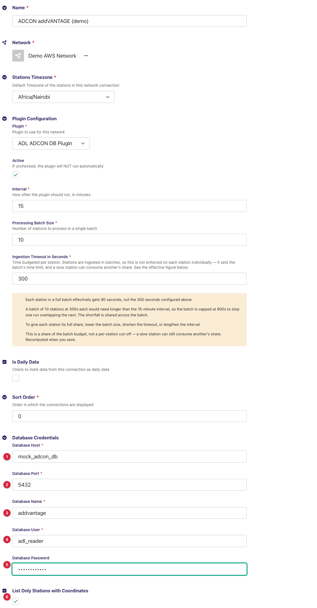
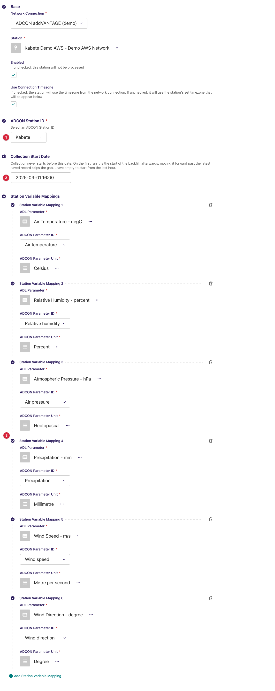
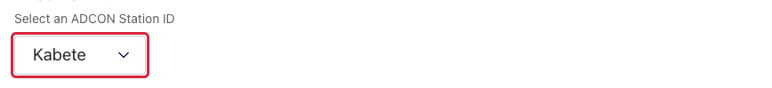
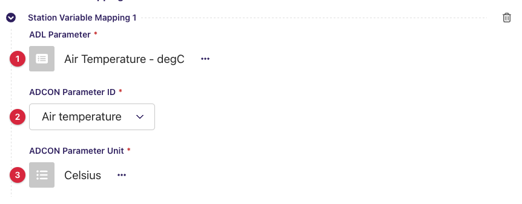
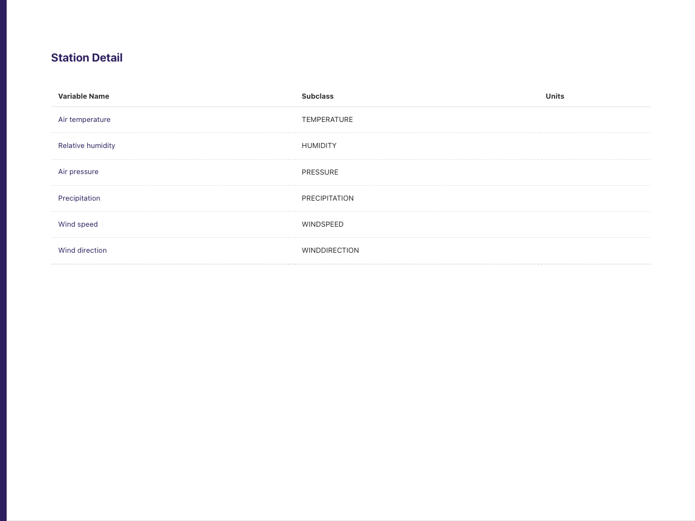
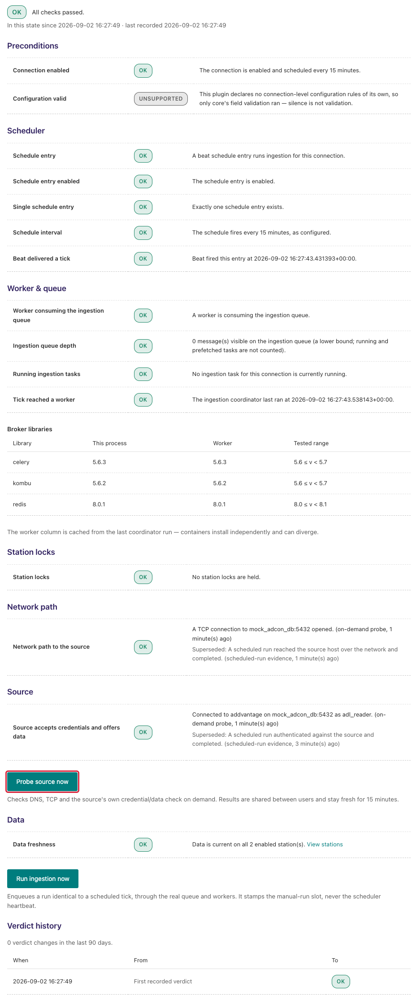
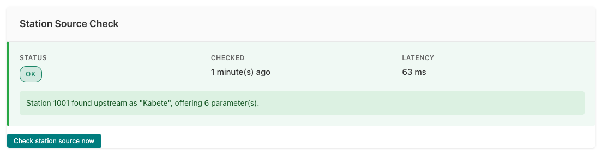

# ADL ADCON DB Plugin

Collects observation data from an **ADCON Telemetry addVANTAGE Pro** server by
reading its **PostgreSQL database directly** and saves it into an ADL instance.
This is a *pull* plugin: on each collection cycle ADL opens a database
connection, queries the historian table for the parameter tags you have mapped
over a time window, and stores the returned samples against your ADL stations
and data parameters. No ADCON API or export job is involved.

**Repository:** [adl-adcon-db-plugin](https://github.com/wmo-raf/adl-adcon-db-plugin)
**Plugin type identifier:** `adl_adcon_db_plugin`
**Connection model:** `ADCONDBConnection` · **Station link model:** `ADCONStationLink`

> **About the screenshots.** Every image in this guide is regenerated from
> `docs/screenshots.yml` against a seeded demo instance, so hostnames, station
> names, ids and readings in them are placeholders — not values to copy. The
> field tables are the reference for what to enter.

## Overview

addVANTAGE stores its configuration tree and its measurements in two tables
the plugin reads (and only reads):

| Table | What the plugin uses it for |
|---|---|
| `node_60` | The device tree. Rows with `dtype = 'DeviceNode'` are **stations** (id, display name, coordinates, timezone); rows with `dtype = 'AnalogTagNode'` are the **parameter tags** of a station (`parent_id` points at the station). The admin's station and parameter selects are filled from here. |
| `historiandata` | The measurements: one row per tag and sampling interval, with `startdate`/`enddate` as Unix seconds, `measuringvalue`, and a `status` (0 = valid). |

One collection cycle, per enabled station link: the plugin connects, selects
the rows of the station's mapped tag ids whose interval falls inside the
window and whose status is 0, keeps those with a 3–20 minute sampling
interval, groups them by `enddate` into one record per timestamp, and hands
them to ADL, which stores each mapped tag's value after unit conversion.

## Prerequisites

- A running ADL instance (see the ADL installation guide).
- Network access from the ADL host to the addVANTAGE **PostgreSQL port**
  (`5432` by default) on the database host — usually the addVANTAGE server
  itself. This is a database connection, not HTTP: the port must be open in
  the server's firewall and `pg_hba.conf` must accept connections from the
  ADL host's address.
- A **database account** for ADL. Ask the addVANTAGE administrator for a
  dedicated login with `SELECT` on `node_60` and `historiandata` only; the
  plugin never writes. The account's name, password and the database name
  (often `addvantage`) go into the connection form.

## Installation

Installed like any ADL plugin — see the core *Plugin Installation* page for all
methods. The `plugins.toml` entry:

```toml
[[plugins]]
name = "ADL ADCON DB Plugin"
git  = "https://github.com/wmo-raf/adl-adcon-db-plugin.git"
tag  = "0.2.0"
```

After rebuild/restart, confirm with `docker compose exec adl list-plugins`.

## Connection configuration

In the ADL admin, create a new **ADCON Database Connection**. Base connection
fields (name, network, timezone, plugin processing settings) are described in
the core user guide. Plugin-specific fields:

| Field | Required | Default | Description |
|---|---|---|---|
| Database Host | yes | — | Hostname or IP address of the PostgreSQL server holding the addVANTAGE database. This is what the network diagnostic dials. |
| Database Port | yes | — | PostgreSQL port, normally `5432`. |
| Database Name | yes | — | The addVANTAGE database, typically `addvantage`. |
| Database User | yes | — | The read-only account described under Prerequisites. |
| Database Password | no | — | The account's password. Leave empty only when the server authenticates the ADL host another way (`trust` in `pg_hba.conf`). |
| List Only Stations with Coordinates | no | off | When on, the station select on station links lists only `DeviceNode` rows that have both latitude and longitude — hides loggers, repeaters and retired nodes without a position. |



The connection holds no variable mappings: every addVANTAGE station has its
own tag ids, so mappings are defined **per station link** (next section).

## Station link configuration

For each station to collect, create an **ADCON Station Link**:

| Field | Required | Default | Description |
|---|---|---|---|
| ADCON Station ID | yes | — | The station's `node_60` id, chosen from a list the plugin loads from the database once the *Network Connection* above it is selected; options show the station's addVANTAGE display name. |
| Collection Start Date | no | empty | Collection never starts before this date, and it must be in the past. On the first run it is the start of the backfill (the historian holds history, so backfill works); moving it forward past the latest saved record skips the gap. Leave empty to start from the last hour. |
| Station Variable Mappings | yes (at least one) | — | One row per tag to store; see below. A station with no mappings raises an error on every run (`No parameter ids provided`). |



### Station variable mappings

| Field | Description |
|---|---|
| ADL Parameter | The ADL `DataParameter` the values are stored under. |
| ADCON Parameter ID | The tag to read, chosen from the `AnalogTagNode` rows under the selected station; options show the tag's display name (e.g. *Air temperature*), the stored value is its id. A tag id can be mapped only once across all station links. |
| ADCON Parameter Unit | The unit addVANTAGE stores that tag in. ADL converts from this unit to the ADL parameter's unit, so it must match the sensor's configured unit on the addVANTAGE side — check it in addVANTAGE (the plugin's *Station Detail* page below lists the tags, but its Units column is always empty — the query behind it does not read units). |

**Example:** ADL Parameter `Air Temperature` ← ADCON Parameter *Air
temperature* (tag id `10011`) with unit `degC`.

Only mapped tags are queried: a station may have many more tags in
addVANTAGE, but ADL collects exactly the mapped set.

## Admin UI added by this plugin

The plugin adds no menu entries or row actions. It adds two **remote-loading
select widgets** on the station link form, both filled from the addVANTAGE
database through the connection you selected, and one **Station Detail** page
that is not linked from the admin but can be opened by URL.

### Step 1 — pick the connection, then the station

Select the *Network Connection* first. The *ADCON Station ID* select shows a
spinner while it queries `node_60`, then fills with the display names of the
server's stations (only those with coordinates, if the connection says so).
Changing the connection reloads the list.



### Step 2 — add a mapping row and pick the tag

Under *Station Variable Mappings*, add a row. The *ADCON Parameter ID* select
loads the tags under the chosen station (their addVANTAGE display names).
Choosing a different station reloads every row's options. Pick the tag, then
the unit it is stored in.



### Step 3 — the Station Detail page (by URL)

`/adl-db-plugin/station-detail/<station link id>/` lists every tag under the
station link's ADCON station in a three-column table — **Variable Name**
(the tag's display name), **Subclass** (addVANTAGE's sensor class, e.g.
`TEMPERATURE`, `WINDSPEED`) and **Units** — which is always empty, since
the page's query does not read the unit; take units from addVANTAGE. It is a
quick way to see what a station offers before mapping; the id in the URL is the station link's ADL
id, visible in the address bar of its edit page. The page has no link in the
admin yet.



### What the widgets report when something is wrong

The selects show a message above them instead of options when the database
query behind them fails:

| Message | Meaning | What to do |
|---|---|---|
| `Network connection ID is required.` | No connection is selected yet. | Select the *Network Connection* first. |
| `The selected connection is not an ADCON Database Connection` | The chosen connection belongs to another plugin. | Pick an ADCON Database connection. |
| `Station ID is required.` | The parameter select was asked before a station was chosen. | Choose the *ADCON Station ID* first. |
| An empty list with no message | The database connection itself failed (wrong host, port, credentials, firewall). | Run the connection's source check (*Source checks / diagnostics* below) — it names the fault. |

## Data collection behavior

- **First run (per station):** starts from the *Collection Start Date* if set,
  otherwise from the last hour.
- **Subsequent runs:** continue from the latest saved record; the window ends
  at the top of the next hour in the station's timezone.
- **Backfill:** set *Collection Start Date* in the past before the first run;
  `historiandata` holds history, so the whole range is fetched in one run
  (large ranges take time — the run's timeout is the connection's ingestion
  timeout).
- **Query:** rows with `tag_id` in the mapped set, `startdate >= window
  start`, `enddate <= window end` and `status = 0`. Rows flagged invalid by
  addVANTAGE are never stored.
- **Sampling interval filter:** only rows whose `enddate − startdate` is at
  least 3 and under 20 minutes are kept — the 10/15-minute logger samples.
  Hourly or daily aggregate rows addVANTAGE also writes to the historian are
  dropped, as are sub-3-minute raw samples.
- **Observation time:** the row's `enddate`, converted to the station's
  timezone. `startdate`/`enddate` are Unix timestamps, so the timezone only
  labels the instant; it does not shift it.
- **Timezones:** the window is computed in the station's timezone (the
  connection's *Stations Timezone* unless the link overrides it) and sent as
  Unix timestamps.
- **Connection lifetime:** one database connection per station per run,
  closed when the station is done. The ingestion connect has no timeout; the
  diagnostic checks use a 5-second one.

## Source checks / diagnostics

The plugin implements the ADL source-check contracts, so the core's
monitoring screens can tell network faults, credential faults and
configuration faults apart *for this connection specifically*. The screens
below are rendered by the ADL core, but what they display for an ADCON
connection comes from this plugin (and from PostgreSQL itself — see the
catalogue). The core's own messages on the same screens are catalogued in the
core guide's [Monitoring & Diagnostics](https://adl.readthedocs.io/en/latest/user_guide/monitoring_and_diagnostics.html) page.

### Where check results appear

**Ingestion Diagnostic page.** From the connections list, the Health column of
your ADCON connection links to its **Ingestion Diagnostic** page
(`/monitoring/connection/<id>/health/`). It shows a layered verdict — network
reachability of the database host and port at the bottom, then whether the
database accepted the account — with a verdict history. **Probe source now**
re-dials the database immediately (at most once per minute); **Run ingestion
now** triggers a full collection cycle, useful right after fixing a password
or a grant.



**Station Source Check panel.** Open a station link's **Inspect** page (from
the station links list, via the row's "..." menu). Alongside the Collection
Status card — which also offers **Trigger Collection Now** — a **Station
Source Check** card shows the latest station-level result: status badge,
time, latency and the message produced by this plugin.



### What each check verifies

| Check | What it verifies |
|---|---|
| Endpoint probe | DNS resolution and TCP reach of *Database Host* : *Database Port*. Run by the core; the plugin only names the endpoint. |
| Connection check | Connects with the configured account (5-second connect timeout) — libpq completes the handshake, credential and database selection inside the connect — then runs one `SELECT 1` on a read-only session. That round trip catches a server in recovery, a connection limit hit at the first statement, and a pooler that accepts the login but fails the first query. It does **not** prove the account can read the two tables — that is the station check's job. |
| Station check | Reads the station table and confirms the configured *ADCON Station ID* is a `DeviceNode` there (positive proof of absence otherwise), then queries the station's tags — for its error rather than its result, since it is the only place a missing `SELECT` grant on a table shows up. Reports the upstream name and tag count. |

### Feedback catalogue — messages this plugin produces

Connection-level failures carry PostgreSQL's own error text, so the messages
below are shaped as libpq prints them (host names and user names are yours).
Find the message you see:

| Message (example) | Status | Meaning | What to do |
|---|---|---|---|
| `Connected to addvantage on 10.20.0.5:5432 as adl_reader.` | OK | Login accepted and a query answered. | Nothing — healthy. |
| `Station 1001 found upstream as "Kabete", offering 6 parameter(s).` | OK | The station exists in `node_60`; its addVANTAGE name and tag count are shown so a valid-but-wrong id is caught. (Without a display name: `Station 1001 was found in the source's station table, offering 6 parameter(s).`) | Check the name matches your intended station; zero parameters means nothing can be mapped. |
| `Station 1001 was not found in the source's station table.` | FAILED | Positive proof: the station table was read and holds no `DeviceNode` with that id. | Re-select the station on the station link form. |
| `FATAL:  password authentication failed for user "adl_reader"` | FAILED | Wrong password (or wrong user) — SQLSTATE 28P01. | Re-enter *Database User* / *Database Password*. |
| `FATAL:  no pg_hba.conf entry for host "41.x.x.x", user "adl_reader", database "addvantage", …` | FAILED | The server refuses this client address/user/database combination — SQLSTATE 28000. | Have the addVANTAGE administrator add the ADL host to `pg_hba.conf`. |
| `FATAL:  database "addvantag" does not exist` | FAILED | Wrong *Database Name* — SQLSTATE 3D000. | Fix the database name. |
| `permission denied for table node_60` / `… for table historiandata` | FAILED | The account lacks `SELECT` on that table — SQLSTATE 42501. Seen on the **station** check; the connection check passes. | Grant `SELECT` on both tables to the account. |
| `connection to server at "db.example.org" (10.20.0.5), port 5432 failed: Connection refused` | FAILED | Nothing listens on that host/port, or a firewall rejects. The network probe (layer 4) reports the same fault first. | Check host, port and firewall. |
| `connection to server at … failed: timeout expired` | FAILED | No answer within the 5-second connect timeout — a silently dropping firewall or a wrong address. | Check the network path from the ADL host. |
| `FATAL:  the database system is starting up` | FAILED | Server in recovery/restarting (SQLSTATE 57P03). | Retry in a minute. |
| `FATAL:  sorry, too many clients already` | FAILED | Server connection limit reached (SQLSTATE 53300). | Ask the administrator to raise `max_connections` or free sessions. |

## Troubleshooting

**Connection check passes but the station select is empty**
: The account can log in but cannot read `node_60` (the station check will
  say `permission denied for table node_60`), or *List Only Stations with
  Coordinates* is on and the stations have no position in addVANTAGE.

**Station and connection checks pass but nothing is collected**
: Check the mapped tags actually receive data at a 10- or 15-minute interval:
  tags configured as hourly aggregates fall outside the 3–20 minute filter
  and are dropped. Also check `status` — addVANTAGE marks suspect samples
  with a non-zero status and the plugin ignores them.

**`No parameter ids provided` in the activity log**
: The station link has no variable mappings. Add at least one.

**Cannot save a mapping: "ADCON Parameter ID … already exists"**
: Each tag id may be mapped once, system-wide. The tag is already mapped on
  another station link (or twice on this one).

**Values are off by a constant factor**
: The *ADCON Parameter Unit* does not match the unit addVANTAGE stores the tag
  in; ADL then converts from the wrong unit. Verify the sensor's unit in
  addVANTAGE.

**Observation times are shifted by a fixed number of hours**
: The historian stores Unix timestamps, so the plugin cannot mislabel them —
  but the *window* is computed in the station's timezone. If the connection's
  *Stations Timezone* is wrong, the window (and therefore what is fetched per
  run) is wrong; fix the timezone.

## Compatibility

| Plugin version | Requires ADL core | Notes |
|---|---|---|
| 0.2.0 | Core with source-check contracts for full diagnostics (≥ 0.8.12) | Runs on older cores too; the source-check integration is simply inactive there. Reads addVANTAGE's `node_60` / `historiandata` layout as shipped with addVANTAGE Pro 6.x. |

## Changelog

See [GitHub Releases](https://github.com/wmo-raf/adl-adcon-db-plugin/releases).
